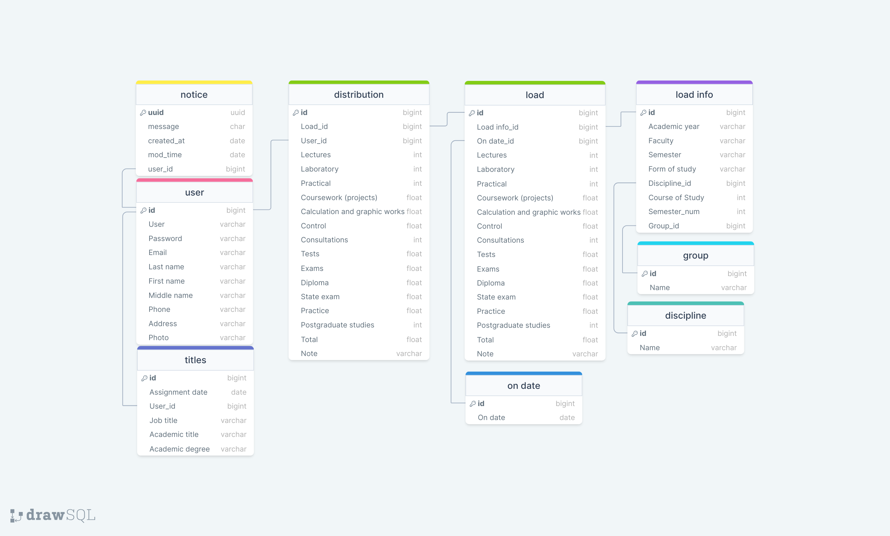

## WEB-приложение "Учебная нагрузка кафедры ВУЗа"
Приложение представляет некую "страничку" кафедры учебного заведения.

В приложении реализован функционал распределения учебной нагрузки между преподавателями.

Приложение написано с использованием:
* Djongo.
* SQLite.
* Django REST framework.

Реализован функционал рассылки сообщений:
* Подтверждения регистрации.
* Объявлений (сотрудникам кафедры).

Планируется реализовать микросервисы, добавить API и выполнить контейнеризацию.

## Предполагаемое расширение функционала приложения

Разработать и реализовать функционал выполнения нагрузки каждым преподавателем с возможности автоматизации заполнения индивидуального плана.

Организовать выгрузку в файл с рассылкой абонентам.

## Схема базы данных

